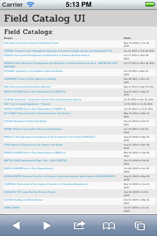

!SLIDE bullets incremental
# Responsive Design

*Responsive web design (RWD) is a web design approach aimed at crafting sites to provide an optimal viewing experience—easy reading and navigation with a minimum of resizing, panning, and scrolling—across a wide range of devices (from desktop computer monitors to mobile phones).* - <http://en.wikipedia.org/wiki/Responsive_web_design>

!SLIDE bullets incremental
# Responsive Design Elements

- dynamic **CSS** based on media queries of device display properties
- fluid grid based on percentages
- fluid image sizes based on percentages

!SLIDE bullets incremental
# Responsive Design

## write once, display anywhere

- desktops
- phones
- tablets

!SLIDE bullets incremental
# Responsive Design

- When done properly, responsive web pages look nice and work well on - variety of devices and form factors.

!SLIDE bullets incremental
# Responsive Bootstrap

**Bootstrap's** responsive-design **CSS** takes care of a lot of this:

    @@@html
    <link href="bootstrap-responsive.css"
          media="screen"
          rel="stylesheet"
          type="text/css" />

=> *responsive magic*

!SLIDE bullets incremental
# Responsive Bootstrap

- fluid grid elements "stack" when width is constrained
- navbar collapses to a dropdown menu
- provides easily accessed utility classes:

    - `.visible-phone` / `.hidden-phone`: `<768 px`
    - `.visible-tablet` / `.hidden-tablet`: `768-979 px`
    - `.visible-desktop` / `.hidden-desktop`: `>979 px`

!SLIDE bullets incremental
# Responsive Viewport

- By default, mobile browsers try to mimic desktop display
- this results in pages scaled down to fix full web page onto a small mobile display
- Apple implemented hooks to a `viewport` meta tag
- Allows assignment of page width, based on pixels, device width, scaling, etc.

!SLIDE smaller incremental center
# Responsive Viewport

Default, no viewport tag:

!SLIDE smaller incremental center
# Responsive Viewport

Viewport tagged

    @@@html
    <meta content='width=device-width, initial-scale=1'
     name='viewport'>

